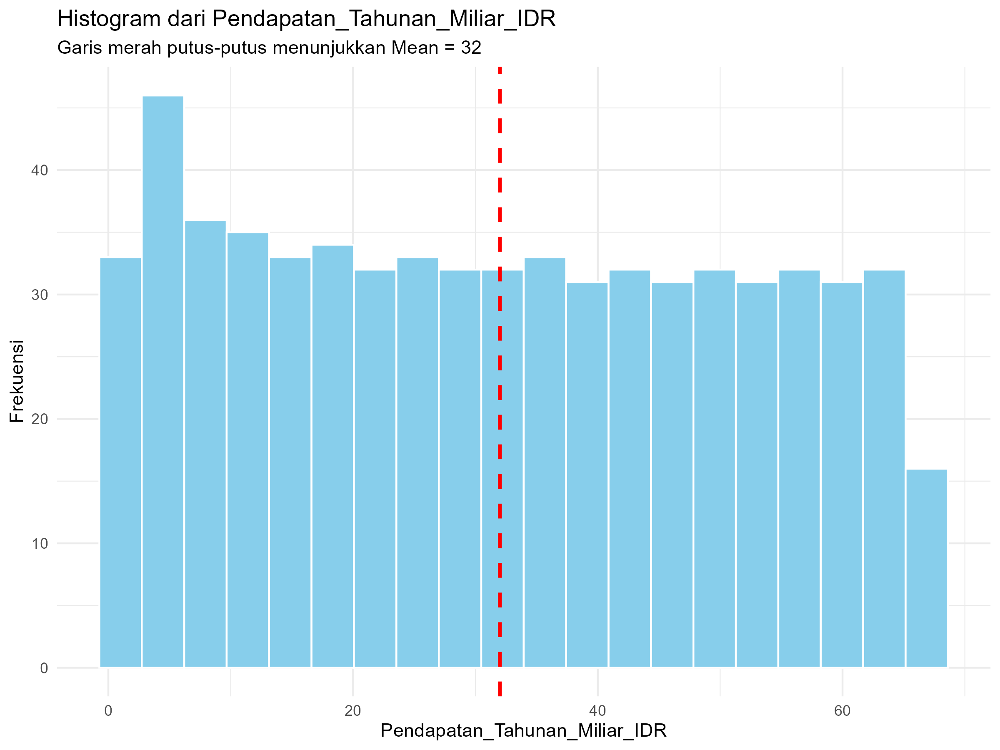
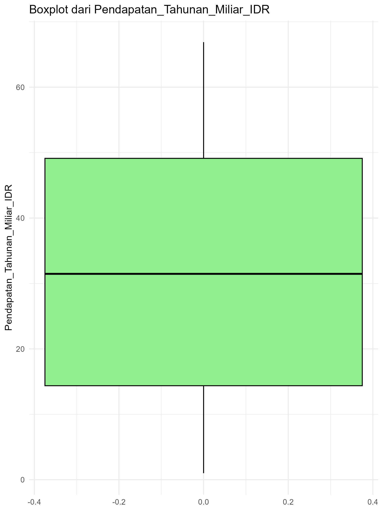
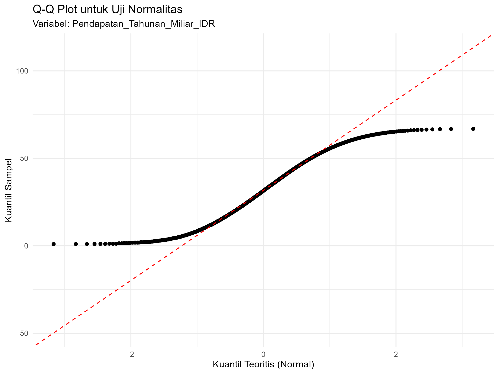
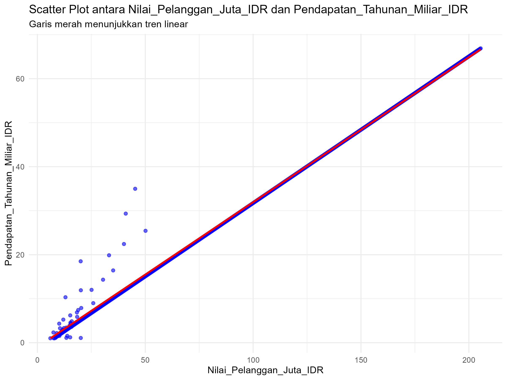
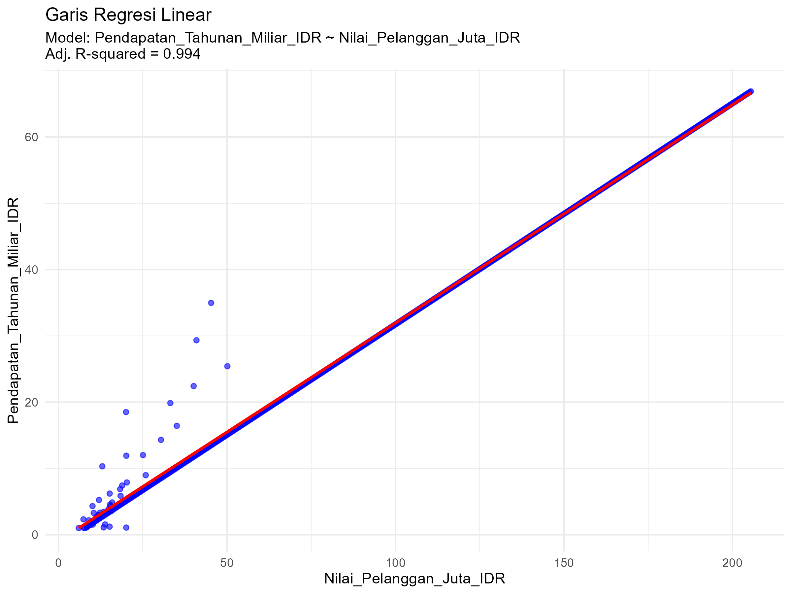

# Tugas Analisis Statistik: Deskriptif, Korelasi, dan Regresi

## 1. Informasi Penyusun

-   **Nama:** `I Made Dwi Andhika Putra Adnyana`
-   **NIM:** `2515101059`
-   **Program Studi:** `ILMU KOMPUTER`
-   **Mata Kuliah:** Statistika dan Probabilitas

------------------------------------------------------------------------

## 2. Deskripsi Proyek

Dataset yang digunakan dalam analisis ini merupakan data startup yang memuat informasi mengenai nilai pelanggan dan pendapatan tahunan perusahaan. Dua variabel utama yang menjadi fokus penelitian adalah Nilai_Pelanggan_Juta_IDR sebagai variabel independen, yaitu estimasi nilai pelanggan dalam satuan juta rupiah, serta Pendapatan_Tahunan_Miliar_IDR sebagai variabel dependen, yaitu jumlah pendapatan tahunan yang dihasilkan oleh perusahaan dalam satuan miliar rupiah.

Tujuan dari analisis ini adalah untuk memperoleh gambaran menyeluruh mengenai struktur data melalui statistik deskriptif, memeriksa asumsi normalitas untuk menilai karakter distribusi masing-masing variabel, dan mengevaluasi kekuatan hubungan antara nilai pelanggan dan pendapatan tahunan menggunakan analisis korelasi. Selanjutnya, dilakukan pembangunan model regresi linear sederhana untuk menguji sejauh mana Nilai_Pelanggan_Juta_IDR dapat berperan sebagai prediktor terhadap Pendapatan_Tahunan_Miliar_IDR. Hasil dari model ini diharapkan dapat memberikan pemahaman awal mengenai pola hubungan linear kedua variabel, serta menjadi dasar dalam mengembangkan model prediksi atau kajian lanjutan yang lebih mendalam.

------------------------------------------------------------------------

## 3. Struktur Proyek

Proyek ini diorganisir ke dalam beberapa folder:

-   `/data`: Berisi dataset mentah yang digunakan untuk analisis.

-   `/scripts`: Berisi semua skrip R yang digunakan dalam analisis, diurutkan berdasarkan alur kerja.

-   `/results`: Berisi output dari analisis, seperti plot, gambar, atau tabel ringkasan.

------------------------------------------------------------------------

## 4. Cara Menjalankan Analisis

Untuk mereproduksi hasil analisis ini, ikuti langkah-langkah berikut: 1. Pastikan Anda memiliki R dan RStudio terinstal.

2.  Buka proyek R ini di RStudio.

3.  Instal paket yang diperlukan dengan menjalankan perintah berikut di konsol R:

    ``` r
    # install.packages(c("tidyverse", "corrplot", "knitr"))
    ```

4.  Jalankan skrip di dalam folder `/scripts` secara berurutan, mulai dari `01_data_preparation.R` hingga `05_analisis_regresi.R`.

------------------------------------------------------------------------

## 5. Hasil dan Interpretasi

Di bagian ini, mahasiswa diharapkan untuk menyajikan dan menginterpretasikan hasil dari setiap tahap analisis.

### 5.1. Statistik Deskriptif

-   **Ukuran Pemusatan (Mean, Median, Modus):**

    -   *Ringkasan:* Berdasarkan hasil analisis statistik deskriptif, diperoleh nilai mean sebesar 32, median sebesar 31,47, dan modus sebesar 1,87.

    -   *Interpretasi:* Nilai mean dan median pada variabel Pendapatan_Tahunan_Miliar_IDR yang hampir sama menunjukkan bahwa data pendapatan secara umum tersebar cukup seimbang di sekitar nilai tengah dan tidak terlalu berat ke salah satu sisi.

-   **Ukuran Sebaran (Standar Deviasi, Range, Kuartil):**

    -   Data pendapatan menunjukkan tingkat penyebaran yang cukup tinggi dengan nilai standar deviasi sebesar 19,75. Nilai pendapatan terendah berada pada angka 1, sedangkan nilai tertinggi mencapai 66,89. Berdasarkan ukuran kuartil, 25% data berada di bawah 14,37 (Q1), nilai tengah data berada pada 31,47 (median), dan 75% data berada di bawah 49,12 (Q3).

    -   *Interpretasi:* Data pendapatan memiliki standar deviasi sebesar 19,75, dengan nilai minimum 1 dan nilai maksimum 66,89. Berdasarkan distribusi kuartil, kuartil pertama bernilai 14,37, nilai median berada pada 31,47, dan kuartil ketiga mencapai 49,12.

-   **Visualisasi (Histogram/Boxplot):**

    

    

    -   *Interpretasi:* Histogram memperlihatkan bahwa data pendapatan tersebar pada berbagai interval nilai dan tidak mengikuti pola distribusi normal. Sementara itu, boxplot menunjukkan rentang data yang relatif luas dengan posisi median berada di sekitar bagian tengah, yang mengindikasikan tingkat variasi data yang cukup tinggi serta tidak adanya kecenderungan distribusi ke satu sisi tertentu.

### 5.2. Uji Normalitas

-   **Hasil Uji Shapiro-Wilk:**

    -   *Nilai p-value:* Hasil uji Shapiro-Wilk terhadap variabel Pendapatan_Tahunan_Miliar_IDR menghasilkan nilai p-value sebesar 1,985e-14.

    -   *Interpretasi:* Karena nilai p-value lebih kecil dari 0,05, maka dapat disimpulkan bahwa variabel Pendapatan_Tahunan_Miliar_IDR tidak terdistribusi normal secara statistik.

-   **Plot Q-Q:**

    

    -   *Interpretasi:* Pada Q-Q plot, titik-titik data dari variabel Pendapatan_Tahunan_Miliar_IDR tidak mengikuti garis lurus, terutama pada bagian awal dan akhir. Hal ini memperkuat hasil uji Shapiro-Wilk bahwa data pendapatan tidak mengikuti distribusi normal.

### 5.3. Analisis Korelasi

-   **Nilai Koefisien Korelasi:**

    -   *Nilai r:* Hasil uji korelasi Pearson antara variabel Nilai_Pelanggan_Juta_IDR dan Pendapatan_Tahunan_Miliar_IDR menghasilkan nilai koefisien korelasi (r) sebesar 0,997 dengan p-value \< 2,2e-16.

    -   *Interpretasi:* Nilai koefisien korelasi yang sangat mendekati 1 menunjukkan adanya hubungan positif kuat antara variabel Nilai_Pelanggan_Juta_IDR dan Pendapatan_Tahunan_Miliar_IDR. Artinya, semakin tinggi nilai pelanggan, maka pendapatan tahunan startup cenderung semakin tinggi.

-   **Visualisasi (Scatter Plot):**

    

    -   *Interpretasi:* Scatter plot memperlihatkan adanya pola hubungan yang jelas dan cenderung meningkat antara variabel Nilai_Pelanggan_Juta_IDR dan Pendapatan_Tahunan_Miliar_IDR. Pola tersebut sejalan dengan hasil uji korelasi yang menunjukkan adanya hubungan positif yang sangat kuat antara kedua variabel.
      
### 5.4. Analisis Regresi

-   **Model Regresi:**

    -   *Persamaan regresi: Y = b0 + b1*X: Model regresi linear yang diperoleh adalah sebagai berikut: Pendapatan_Tahunan_Miliar_IDR = -0,98 + 0,33 × Nilai_Pelanggan_Juta_IDR

    -   *Interpretasi:* Nilai intercept (-0,98) menunjukkan nilai Pendapatan_Tahunan_Miliar_IDR yang diprediksi ketika Nilai_Pelanggan_Juta_IDR bernilai nol. Sementara itu, nilai slope sebesar 0,33 menunjukkan bahwa setiap kenaikan satu satuan pada variabel Nilai_Pelanggan_Juta_IDR diperkirakan akan meningkatkan Pendapatan_Tahunan_Miliar_IDR sebesar 0,33 satuan.

-   **Evaluasi Model (R-squared):**

    -   *Nilai R-squared:* Nilai Adjusted R-squared dari model regresi adalah sebesar 0,994 atau 99,4%.

    -   *Interpretasi:* Nilai tersebut mengindikasikan bahwa sekitar 99,4% variasi pada Pendapatan_Tahunan_Miliar_IDR dapat diterangkan oleh Nilai_Pelanggan_Juta_IDR melalui model regresi linear yang digunakan.

-   **Visualisasi (Garis Regresi pada Scatter Plot):**

    

    -   *Interpretasi:* Garis regresi terlihat menyesuaikan pola sebaran data antara variabel Nilai_Pelanggan_Juta_IDR dan Pendapatan_Tahunan_Miliar_IDR secara sangat baik, sehingga menunjukkan bahwa model regresi linear mampu menggambarkan hubungan antara kedua variabel tersebut dengan tingkat akurasi yang tinggi.

## 6. Kesimpulan

Berdasarkan hasil pengolahan data, variabel Pendapatan_Tahunan_Miliar_IDR memiliki nilai rata-rata dan median yang relatif berdekatan, sehingga menunjukkan bahwa distribusi pendapatan tidak menunjukkan kemencengan yang ekstrem ke salah satu arah. Namun demikian, perbedaan pendapatan antar startup tergolong besar, sebagaimana tercermin dari nilai standar deviasi yang tinggi serta rentang data yang luas.

Pengujian normalitas menggunakan metode Shapiro–Wilk yang diperkuat dengan visualisasi Q–Q plot mengindikasikan bahwa data pendapatan secara statistik tidak mengikuti distribusi normal.

Selanjutnya, hasil analisis korelasi Pearson menunjukkan adanya hubungan positif yang sangat kuat antara Nilai_Pelanggan_Juta_IDR dan Pendapatan_Tahunan_Miliar_IDR, yang mengimplikasikan bahwa peningkatan nilai pelanggan cenderung diikuti oleh kenaikan pendapatan tahunan.

Temuan tersebut diperkuat melalui analisis regresi linear, di mana variabel Nilai_Pelanggan_Juta_IDR terbukti memberikan pengaruh yang sangat signifikan terhadap Pendapatan_Tahunan_Miliar_IDR. Model regresi yang dihasilkan mampu menjelaskan sekitar 99,4% variasi pendapatan tahunan, sehingga dapat disimpulkan bahwa model tersebut sangat representatif dalam menggambarkan hubungan antara kedua variabel.

